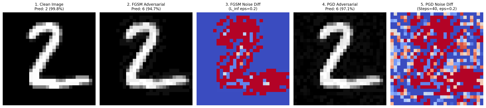

# 🛡️ Adversarial Gradient Visualizer: FGSM vs. PGD Case Study

An end-to-end deep learning security project visualizing and analyzing gradient-based adversarial evasion attacks (**Fast Gradient Sign Method** vs. **Projected Gradient Descent**) against a PyTorch Convolutional Neural Network (CNN) trained on MNIST.

---

## Executive Summary

Machine learning models deployed in security-critical environments are susceptible to **adversarial perturbations**—imperceptible, mathematically crafted noise added to inputs that forces misclassification while remaining virtually indistinguishable to the human eye.

This project implements:
1. A baseline **PyTorch CNN classifier** trained on MNIST.
2. A single-step **FGSM ($L_\infty$)** attack.
3. An iterative **Projected Gradient Descent (PGD - $L_\infty$)** adversary.
4. A **1x5 visual matrix** inspecting pixel-level noise heatmaps and confidence shifts.
5. A comprehensive post-mortem detailing the **"Short Walk Problem"** encountered during adversarial hyperparameter tuning.

---

## Model Architecture

The target classifier is a lightweight, deterministic Convolutional Neural Network (`SimpleCNN`) designed for fast convergence and clear gradient flow:

```
Input [1, 28, 28] (Normalized: mean=0.1307, std=0.3081)
       │
       ▼
[ Conv2d(in=1, out=16, kernel=3, padding=1) ] ──► [ ReLU() ] ──► [ MaxPool2d(2, 2) ]
       │
       ▼
[ Flatten() ] ──► (14 × 14 × 16 = 3136 features)
       │
       ▼
[ Linear(in=3136, out=10) ]
       │
       ▼
Logits [10 Classes]
```

---

## Attack Mathematics & Formulations

### 1. Fast Gradient Sign Method (FGSM)
FGSM is a fast, one-step attack that moves the input tensor in the direction of the loss function's gradient sign with respect to the input:

$$x_{\text{adv}} = \text{clip}\Big(x + \epsilon \cdot \text{sign}\big(\nabla_x \mathcal{L}(\theta, x, y)\big)\Big)$$

* **Pros**: Extremely fast ($\mathcal{O}(1)$ gradient computation).
* **Cons**: Susceptible to gradient masking, non-linear curvature, and overshooting optimal local maxima.

### 2. Projected Gradient Descent (PGD)
PGD is the standard multi-step first-order adversarial adversary. It iteratively computes gradient updates and projects the perturbed sample back onto the $L_\infty$ $\epsilon$-ball $\mathcal{S}$:

$$x^{t+1} = \Pi_{x + \mathcal{S}} \left( x^t + \alpha \cdot \text{sign}\big(\nabla_{x^t} \mathcal{L}(\theta, x^t, y)\big) \right)$$

where:
* $\alpha$ is the step size per iteration.
* $\Pi$ is the projection operator clipping values back into $[x - \epsilon, x + \epsilon] \cap [x_{\min}, x_{\max}]$.
* $t$ is the iteration index ($t \in \{1, \dots, N\}$).

---

## Experimental Results & Metrics

Below are the quantitative evaluation metrics recorded on test sample `Index: 1` (Ground Truth: **Class 2**):

| Evaluation Metric | Clean Baseline | FGSM Adversary | PGD Adversary (Fixed) |
| :--- | :---: | :---: | :---: |
| **Target Epsilon ($\epsilon$)** | $0.0$ | $0.20$ ($L_\infty$) | $0.20$ ($L_\infty$) |
| **Optimization Steps** | N/A | $1$ step | $40$ steps ($\alpha=0.02$) |
| **Model Prediction** | **Class 2** | **Class 6** | **Class 6** |
| **Classification Confidence** | **99.84%** | **94.69%** | **97.44%** |
| **Attack Success** | N/A | ✅ **True** (Fooled) | ✅ **True** (Fooled) |
| **Max $L_\infty$ Pixel Shift** | $0.0000$ | $0.2000$ | $0.2000$ |

---

## 1x5 Visual Matrix Comparison

The attack script generates a 1x5 visual matrix saved as `fgsm_vs_pgd_comparison.png`:



* **Column 1 (Clean Image)**: The original unperturbed digit `2` with 99.84% model confidence.
* **Column 2 (FGSM Adversarial)**: Perturbed digit `2` misclassified as `6` (94.69% confidence).
* **Column 3 (FGSM Noise Diff)**: `coolwarm` heatmap of the single-step directional sign noise.
* **Column 4 (PGD Adversarial)**: Iteratively refined digit `2` misclassified as `6` (97.44% confidence).
* **Column 5 (PGD Noise Diff)**: `coolwarm` heatmap displaying structured, targeted pixel perturbations.

---

## Lessons Learned & The Debugging Chronicles

### 1. The Paradox: When Weak Attacks Seem Stronger
During initial implementation, we encountered an unexpected anomaly:
* **FGSM** successfully fooled the classifier, flipping the prediction from **Class 2** to **Class 6** at **94.69% confidence**.
* **PGD**, theoretically a strictly stronger adversary, **failed to fool the model**, leaving the prediction at **Class 2** with **80.05% confidence**.

```
[Initial Paradoxical Run]
  Clean Image       -> Predicted: Class 2 (99.84% conf)
  FGSM Attack       -> Predicted: Class 6 (94.69% conf)  [SUCCESS]
  PGD Attack        -> Predicted: Class 2 (80.05% conf)  [FAILED]
```

### 2. Root Cause Analysis: The "Short Walk Problem"
A deep dive into the Foolbox parameterization revealed the issue:

```python
# BROKEN CONFIGURATION
pgd_attack = fb.attacks.LinfPGD(steps=40, rel_stepsize=0.01)
```

In Foolbox, `rel_stepsize` is scaled **relative to epsilon ($\epsilon$)**, not the image domain:

$$\alpha = \text{rel\_stepsize} \times \epsilon = 0.01 \times 0.20 = 0.002$$

Over $N = 40$ steps, the maximum possible distance the attack could travel in $L_\infty$ space was:

$$\text{Max Traversal} = 40 \times 0.002 = 0.08$$

Even if the gradient pointed in the exact same direction on every single iteration, PGD was mathematically capped at moving **only 0.08**, utilizing **less than 40% of its authorized $\epsilon = 0.20$ budget**! 

While FGSM instantly jumped the full $0.20$ distance in a single stride, PGD was trapped in a "short walk," never reaching the decision boundary.

### 3. The Engineering Fix: Calibrating Absolute Step Size
To allow PGD to explore the entire $\epsilon$-ball and cross complex local loss barriers, we switched to an absolute step size ($\alpha = 0.02$):

```python
# FIXED CONFIGURATION
pgd_attack = fb.attacks.LinfPGD(steps=40, abs_stepsize=0.02)
```

With $\alpha = 0.02$ across $40$ iterations:

$$\text{Traversable Distance} = 40 \times 0.02 = 0.80 \ge 0.20$$

PGD now had sufficient step budget to traverse the $\epsilon$-ball, project back onto the boundary, and identify the optimal adversarial perturbation.

```
[Post-Fix Calibrated Run]
  Clean Image       -> Predicted: Class 2 (99.84% conf)
  FGSM Attack       -> Predicted: Class 6 (94.69% conf)  [SUCCESS]
  PGD Attack        -> Predicted: Class 6 (97.44% conf)  [SUCCESS ✅ (Strongest Fooling)]
```

---

## How to Reproduce & Run

### 1. Environment Setup
Activate your environment with PyTorch and Foolbox installed:

```bash
conda activate ai-base
# Or install dependencies:
pip install torch torchvision foolbox matplotlib numpy
```

### 2. Train the Baseline Model
```bash
python train.py
```
*Trains `SimpleCNN` on MNIST for 3 epochs and saves weights to `mnist_model.pt`.*

### 3. Run the Adversarial Attack Suite & Visualizer
```bash
python attack.py
```
*Executes both FGSM and calibrated PGD attacks, prints terminal diagnostics, and generates `fgsm_vs_pgd_comparison.png`.*

---

## Key Takeaways for AI Security Engineers

1. **Hyperparameter Coupling**: In iterative attacks like PGD, `steps` and `stepsize` must satisfy $N \times \alpha \ge \epsilon$ (typically $N \times \alpha \approx 1.5\epsilon \text{ to } 2.5\epsilon$) to allow full traversal and boundary projection.
2. **Confidence Degradation vs. Hard Flips**: Even when an attack does not flip a label, monitoring intermediate logits/softmax probabilities reveals vulnerability trends.
3. **Single vs. Multi-Step Defenses**: Models robust against one-step attacks (FGSM) can remain completely vulnerable to multi-step adversaries (PGD), making calibrated PGD the gold standard for empirical robustness evaluation.
